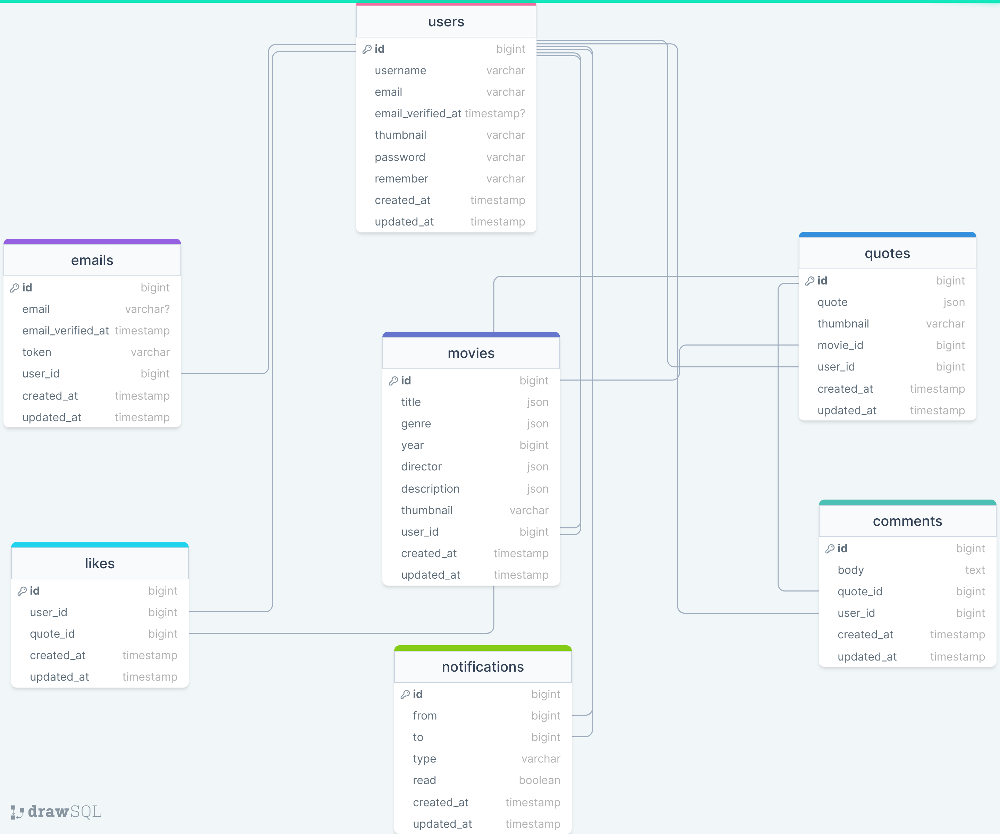

---

Epic movie quotes is a web-site which is type of website, where:

1.  User can be registered through web-platform's registration mechanism and also user's Google Account for more comfort.
2.  User can add, delete and edit his own list of movies.
3.  User can add, delete and edit quotes, created on a base of list of his own movie list.
4.  User can see all the quotes added by another users on a platform on a Newsfeed page.
5.  User can like his/her/their own and others' quotes, as well as comment on them.
6.  User can receive notifications, when other users like/comment user's particular quote.
7.  User can reset his password on a web platform as well as on his profile-edit page.
8.  User can also change his/her/their username on a profile page.
9.  User is being assigned with default picture as avatar upon registration, which he can successfully change later on his profile pag.
10. User can also add secondary email to his profile, which will be available to select as a primary email after verifying one.
11. User , that is logged in with a Google account is only eligible to change his/her profile picture and username. Secondary email service is not available for this user.
12. Website is bilingual, which means that user can use it in two languages: English and Georgian.
13. Language changing functionality is only available on a landing page before authorization.
14. User can also log in to the platform with any verified secondary email user has.
15. When deleting any content like movie, all quotes that belong to this movie, will be terminated too.
16. When deleting any quote, every single comment and like, that belong to this particular quote will be gone too.
17. Movies added by the user are visible only to this user and no one else can see them.
18. While quotes, added by the user are visible to every single person that has verified account on the website.
19. User can't see quotes with account without email being verified.
20. While visiting any non-existent url, user will be aknowledged that particular url has no place on a platform.

#

### Table of Contents

-   [Prerequisites](#prerequisites)
-   [Tech Stack](#tech-stack)
-   [Getting Started](#getting-started)
-   [Migrations](#migration)
-   [Development](#development)
-   [Deployment ](#deployment)
-   [DrawSQL](#drawsql)

#

### Prerequisites

-    *PHP@8.1 and up*
-    _MYSQL@8 and up_
-    _npm@6 and up_
-    _composer@2 and up_

#

### Tech Stack

-    [Laravel@8.x](https://laravel.com/docs/6.x) - back-end framework

-    [Spatie Translatable](https://github.com/spatie/laravel-translatable) - package for translation

-    [Laravel Pusher] - package for live notifications.

#

### Getting Started

1\. First of all you need to clone Epic Movie Quotes repository from github:

```sh
git clone https://github.com/RedberryInternship/aleksandre-elenini-epic-movie-quotes-back
```

2\. Next step requires you to run _composer install_ in order to install all the dependencies.

```sh
composer install
```

3\. after you have installed all the PHP dependencies, it's time to install all the JS dependencies:

```sh
npm install
```

and also:

```sh
npm run dev
```

in order to build your JS/SaaS resources.

4\. Now we need to set our env file. Go to the root of your project and execute this command.

```sh
cp .env.example .env
```

And now you should provide **.env** file all the necessary environment variables:

#

**MYSQL:**

> DB_CONNECTION=mysql

> DB_HOST=127.0.0.1

> DB_PORT=3306

> DB_DATABASE=**\***

> DB_USERNAME=**\***

> DB_PASSWORD=**\***

after setting up **.env** file, execute:

```sh
php artisan config:cache
```

in order to cache environment variables.

4\. Now execute in the root of you project following:

```sh
  php artisan key:generate
```

Which generates auth key.

##### Now, you should be good to go!

#

### Migration

if you've completed getting started section, then migrating database if fairly simple process, just execute:

```sh
php artisan migrate
```

#

#

### Development

You can run Laravel's built-in development server by executing:

```sh
  php artisan serve
```

when working on JS you may run:

```sh
  npm run dev
```

it builds your js files into executable scripts.
If you want to watch files during development, execute instead:

```sh
  npm run watch
```

it will watch JS files and on change it'll rebuild them, so you don't have to manually build them.

#

### Deployment with CI \ CD

<br/>

<br />

Continues Development / Continues Integration & Deployment steps:

-   To fetch all the countries statistics we have to use specially created command 'country:fetch' in terminal. It will initiate fetching data from API-s and will do it automatically every 24 hours because it is scheduled.

-   After running a command, users will be able to see all the information about the statistics worldwide and countrywise.

Then everything should be OK :pray:

#

### DrawSQL


